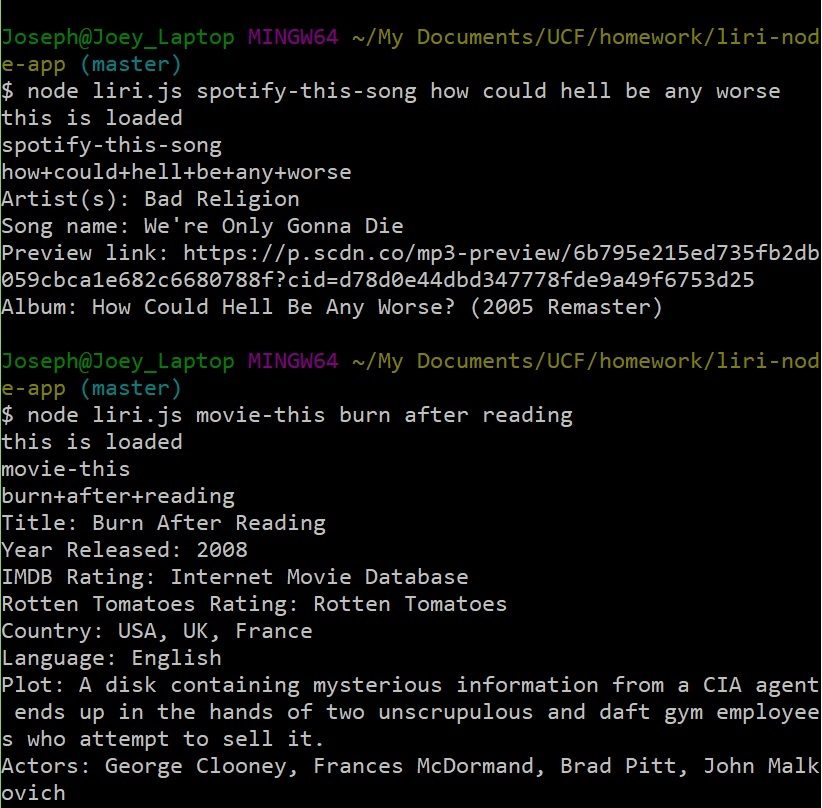

# liri-node-app
------
## Description
This app takes arguments from the terminal and sorts them by movie search, song search, twitter request, or request for random result. Movie and song searches go to OMDb and Spotify respectively to search for data on the movie or song. Twitter request show the user tweets from a dummy account that was created for this project. The random result gives a random search result based on data from a seperate .txt file.
------
## Technology Used
This app is writte with node.js. It uses the following NPM packages: request, Twitter, .env, spotify, and keys.
------
## Screenshot
